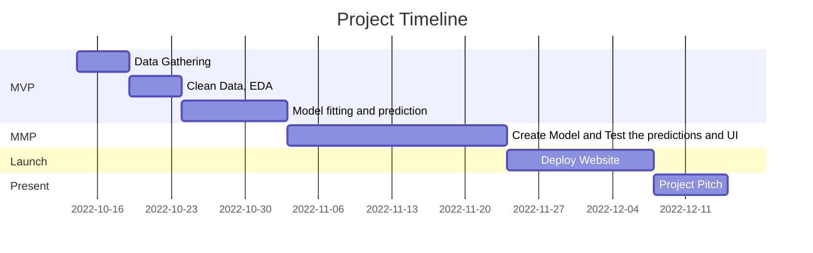
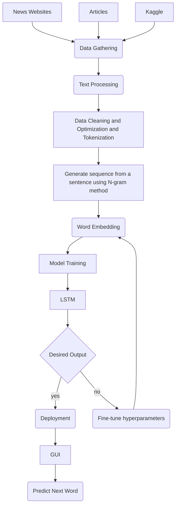

# Next word predictor by Data whisperers.
This is the repository which will contain the group colleborative efforts to the AIDI capstone project, where we will be building Next Word Predictor.

## Steps and timeline of the project

Important Dates:

| Tasks | Approx Start Date | ETA |
| :---   | :--- | :--- |
|Data Gathering|2022-10-14 | 2022-10-19|
|Clean Data, EDA|2022-10-19 | 2022-10-24|
|Model fitting and prediction|2022-10-24 | 2022-11-03|
|Create Model and Test the predictions and UI|2022-11-03 | 2022-11-24|
|Deploy Website|2022-11-24 | 2022-12-08|
|Project Pitch|2022-12-08 | 2022-12-15|



Image created via mermaid diagram : [Code to create it is here](#timeline-code)

## Stage 1
Presentation - [Navigate to Presentation](./Assets/Gifs/Next_word_predictor.pptx)


## Stage 2
Tasks:
- Data Gathering (via Kaggle or Web Scrapping)
- Data cleaning (via python)
- Data Tokenization (python)
- Train Model (jupiter notebook) - [Link to trained jupyter notebook file](/Code/model_training/nextwordpredictor.ipynb)
- Test Model (jupiter)
- Create Website/Mobile App UI kind of Chat Page to get the predictions and when user clicks send that prediction usage to the backend, for futher training (React)
    Few designs that can be proposed:
    - https://dribbble.com/shots/18048819-Zoko-Talking-business (ignore chats from users we are intrested in middle chat space screen)
    - https://dribbble.com/shots/19182547-Conversation-Manager
    - https://office-insider-media.azurefd.net/media/2020/09/predictions-Word-win32.gif prediction that outlook uses (source: https://insider.office.com/hr-hr/blog/text-predictions-in-word-outlook)
    - or we can show chips on top of the typing box
- Create a backend to dump data via web scrapping, and for analytics. (Graphql/Flask/golang and DB can be mongo/postgres)
    - Need to upload the selections of the predictions as well as the word by which the result got predicted in backend to personalise the content.

## Stage 3
Present the Project


## Architecture Diagram
To generate diagram go to:
Mermaid online editor


Image created via mermaid diagram : [Code to create it is here](#architecture-code)


## Git branching stretegy
Follow - [link](https://codingsight.com/git-branching-naming-convention-best-practices/)

We will have these branches
- Bug Fix (Branch Type: Bug)
- Hot Fix (Branch Type: HotFix)
- Feature Branches (Branch Type: Feature)
- Experimental Branches (Branch Type: Exp)
- WIP branches (Branch Type: WIP)

Hence, If we have branch name it has to be
```<author>/<branch-type>/<branch-name>```

We will create feature branches for independent development efforts. If we have experimental branch please do mention as a branch-type so that after mergining in main branch we will know what things to check.

If we have Bug, we will create a issue to track the bugs and progress.

Also It would be best if we can have test cases and we run on localmachine before we create a PR to main branch so that no ones work gets affected.

### Git merge
PRs should be merged only with Squash commit to reduce the commit history into main. While mergebacks should be merged with normal merge to store history of where changes came from.


## References
[1] [mermaid live editor](https://mermaid.live/)

## Extras

#### Timeline-code 



#### Architecture-code
